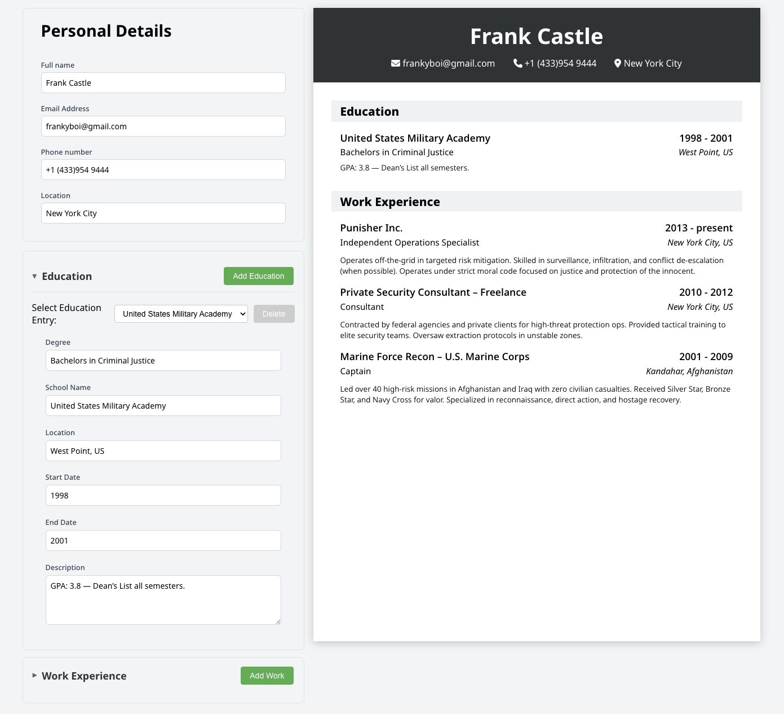

# Resume Builder



A modern, interactive resume builder built with React that allows users to create professional resumes with real-time preview.

## Live Demo

**[Try it live here!](https://resume-builder-mocha-two.vercel.app/)**

## Features

- **Real-time Preview** - See your resume update instantly as you type
- **Interactive Form Fields** - Easy-to-use input forms for all resume sections
- **Expandable Sections** - Collapsible Education and Work Experience sections
- **Dynamic Entry Management** - Add, edit, and delete multiple education and work entries
- **Clean Design** - Professional resume layout with modern styling

## Built With

- **React** - Frontend framework
- **Vite** - Build tool and development server
- **CSS3** - Styling and layout
- **Font Awesome** - Icons for contact information

## How to Use

1. **Personal Details**: Fill in your basic contact information
2. **Education Section**: 
   - Click the arrow to expand the section
   - Add multiple education entries using the "Add Education" button
   - Select between entries using the dropdown
3. **Work Experience**: 
   - Similar to education - expandable with multiple entries
   - Add detailed job descriptions and employment history
4. **Real-time Preview**: Watch your professional resume update as you type

## Running Locally

### Prerequisites
- Node.js (v14 or higher)
- npm or yarn

### Installation

1. Clone the repository:
```bash
git clone https://github.com/yourusername/resume-builder.git
cd resume-builder
```

2. Install dependencies:
```bash
npm install
```

3. Start the development server:
```bash
npm run dev
```

## Learning Outcomes

This project was created to improve my React skills and understanding of state management.

